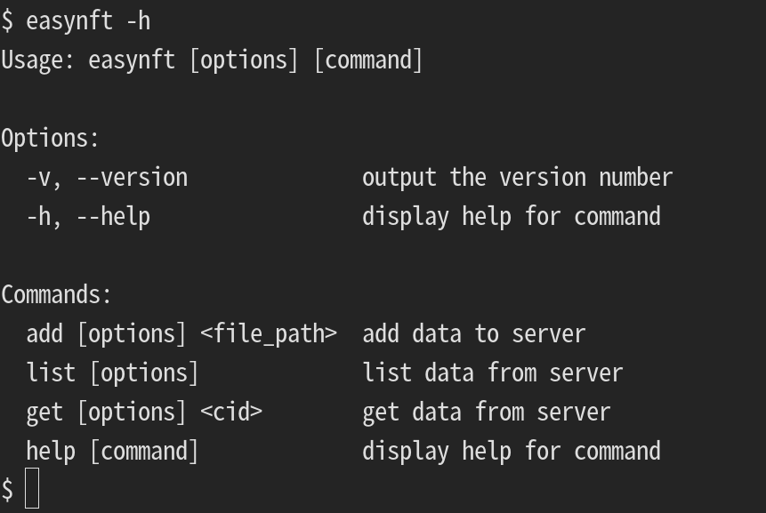

# EasyNFT #
Secure and free storage of NFT data on a distributed network.

## Client ##
Command-Line Tools and SDK for for [EasyNFT Server](./server/README.md).

## Server ##
Http Server for generate metadata and store in [ipfs](https://ipfs.io/)
