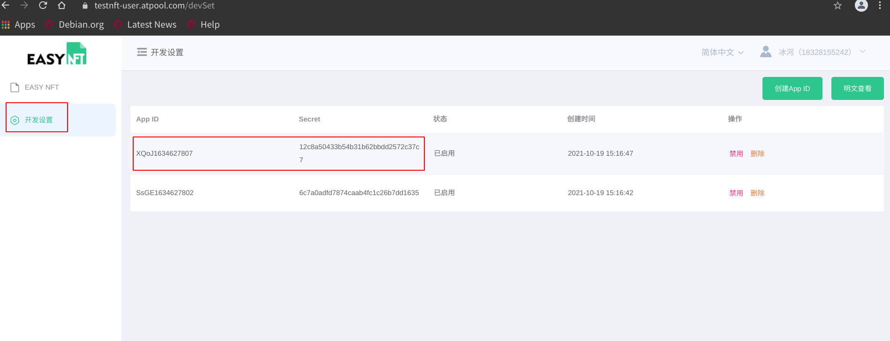

# easynft-client

Command-Line Tools and SDK base on [NodeJS](https://nodejs.org/en/) for [EasyNFT Server](../server/README.md).

### QuickStart   ###

#### Install ####

```bash
# Install
git clone https://github.com/MatrixStorageTech2021/easynft.git
npm install -g easynfy/client
```

#### Configuration ####

```
// {pwd}/config.env

APP_ID=LogG1623754383
APP_SECRET=xxx
APP_VERSION=1.0.0
HOST=http://localhost:7001
HTTP_TIME_OUT=30000

```

##### Get your APP_ID and  APP_SECRET#####

**Setp.1: Get Account for free** 


**Setp.2: Register Or Login** 


**Setp.3: Get APP_ID and  APP_SECRET** 



> see [MATRIX STORAGE](https://storage.anmaicloud.com/?lang=en)  `OPENAPI Docs` for more detail.

#### Usage ####

```bash
# show help detail
easynft -h

#create nft metadata
$ easynft add xxx.png -n name_of_metadata -d 8888 -dn description_of_metadata -p '{"aa":"bb","cc":"dd"}'

# list nft metadata with pagigng
$ easynft list -p 1 -s 5

# get nft metadata with cid
$ easynft get Qmdn5Ggbr4VFV9gwTF4nh4cyipdZQJUAecrcJEQeM17b3e

```

### Code Example

```javascript
const ApiClient = require('./index');
const fs = require('fs');
const config = {
    APP_ID: 'LogG1623754383',
    APP_SECRET: 'xxx',
    APP_VERSION: '1.0.0',
    HOST: 'http://localhost:7001',
    // 请求超时时间，单位毫秒
    HTTP_TIME_OUT: 30 * 1000,
};
const client = new ApiClient(config);

console.debug('==========================start addTest=============================');
let result = await client.add({
    file: fs.createReadStream('D:\\a.png'),
    name: 'this is name',
    description: 'this is description',
    decimals: 11111111111,
    // 自定义可选属性
    properties: {
        aa: 1,
        bb: 'c'
    },
});
console.log(JSON.stringify(result, null , 4));
console.debug('==========================end addTest=============================');

console.debug('start getAllTest');
result = await client.getAll();
console.log(JSON.stringify(result, null , 4));
console.debug('end getAllTest');

console.debug('start getOneTest');
result = await client.getOne( { cid: 'QmUzA3j2VBbmajMVJwCL5JYim86WaJuAj5B4HVWpFyQZLV' });
console.log(JSON.stringify(result, null , 4));
console.debug('end getOneTest');


```
